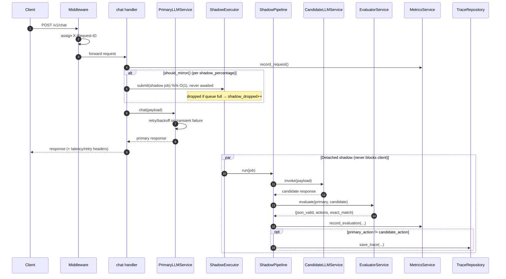

# Shadow Mode LLM Evaluator

A production-ready FastAPI service that proxies chat requests to a **primary**
LLM (filling in a default `model` when the body omits one) and, in the
background, mirrors the same request to a **candidate** LLM
("shadow mode"). It compares the two responses, tracks operational metrics, and
persists divergences for offline inspection — all **without ever affecting the
latency or reliability of the primary response** the client receives.

Typical use case: safely evaluate a new/cheaper/faster model against the model
currently in production, using real traffic, before switching over.

## Table of contents

- [Highlights](#highlights)
- [Architecture](#architecture)
- [Request sequence](#request-sequence)
- [Local setup](#local-setup)
- [Endpoints](#endpoints)
- [curl examples](#curl-examples)
- [Environment variables](#environment-variables)
- [Design notes](#design-notes)
- [Testing](#testing)
- [Project structure](#project-structure)

## Highlights

- **Non-blocking shadow mode** — the client only ever waits on the primary; the
  candidate call, evaluation, and persistence run in a detached worker pool.
- **Bounded concurrency** — a fixed worker pool drains a size-capped
  `asyncio.Queue`; excess shadow work is dropped (never buffered), keeping
  memory flat under load.
- **Resilient primary path** — configurable timeout plus retries with
  exponential backoff, full jitter, a backoff ceiling, and `Retry-After`
  awareness.
- **Automatic evaluation** — validates JSON, extracts a top-level `action`
  field from each response, and compares them exactly (case-sensitive).
- **Runtime-tunable sampling** — `PUT /config` changes the shadow percentage
  live, with no restart.
- **Observability** — structured JSON logs with per-request correlation ids,
  real-time metrics at `GET /metrics`, and SQLite divergence traces.

## Architecture

```mermaid
flowchart TD
    client([Client]) -->|POST /v1/chat| chat["chat route<br/>(thin handler)"]

    chat -->|await| primary["PrimaryLLMService<br/>retries · timeout · backoff"]
    primary -->|HTTP| primaryllm[("Primary LLM")]
    primary -->|response| chat
    chat -->|response| client

    chat -.->|should_mirror?| rc["RuntimeConfig<br/>shadow_percentage"]
    chat -.->|submit job O(1),<br/>never awaited| exec["ShadowExecutor<br/>bounded queue + worker pool"]

    exec --> pipeline["ShadowPipeline<br/>(detached)"]
    pipeline -->|invoke| candidate["CandidateLLMService"]
    candidate -->|HTTP| candidatellm[("Candidate LLM")]
    pipeline -->|primary via Future| evaluator["EvaluatorService<br/>action compare"]
    pipeline --> metrics["MetricsService<br/>(in-memory, locked)"]
    pipeline -->|on divergence| repo["TraceRepository<br/>(aiosqlite)"]
    repo --> db[("SQLite")]

    chat --> metrics
    metricsroute["GET /metrics"] --> metrics
    configroute["GET/PUT /config"] --> rc
```

The request handler stays thin: all execution, retry, timeout, and error logic
lives in the service layer, wired together with FastAPI dependency injection.

## Request sequence



## Local setup

Requires **Python 3.12+**.

```bash
# 1. Create and activate a virtual environment
python3.12 -m venv .venv
source .venv/bin/activate

# 2. Install runtime dependencies
pip install -r requirements.txt

# 3. Configure environment (then set your API keys in .env)
cp .env.example .env

# 4. Run the development server
uvicorn app.main:app --reload
```

The server listens on `http://localhost:8000`. Interactive API docs are at
`/docs` (Swagger UI) and `/redoc`.

Alternatively, run via the module entry point (uses `HOST`/`PORT` from settings):

```bash
python -m app.main
```

> `/v1/chat` requires `PRIMARY_LLM_API_KEY` to be set. Shadow calls additionally
> require `CANDIDATE_LLM_API_KEY` (and `CANDIDATE_LLM_ENABLED=true`); when the
> candidate is unconfigured, shadow work is simply skipped.

## Endpoints

| Method | Path            | Description                                          |
| ------ | --------------- | ---------------------------------------------------- |
| GET    | `/health`       | Liveness probe (app name, environment, version)      |
| GET    | `/health/ready` | Readiness probe (503 until all resources are ready)  |
| POST   | `/v1/chat`      | Proxy a chat request to the primary LLM (+ shadow)   |
| GET    | `/metrics`      | Real-time in-memory operational metrics (plain JSON) |
| GET    | `/config`       | Current runtime config (`shadow_percentage`)         |
| PUT    | `/config`       | Update `shadow_percentage` at runtime (0–100)        |

`POST /v1/chat` response headers:

- `X-Request-ID` — request correlation id (also present in every log line)
- `X-Primary-Latency-Ms` — total upstream latency including retries
- `X-Primary-Retries` — number of retries performed

On upstream failure it returns the mapped status with a JSON error envelope
(`502` unreachable, `504` timeout, `500` misconfigured).

## curl examples

### Health / readiness

```bash
curl http://localhost:8000/health
curl -i http://localhost:8000/health/ready
```

### Chat (primary proxy + background shadow)

```bash
curl -X POST http://localhost:8000/v1/chat \
  -H "Content-Type: application/json" \
  -d '{
    "model": "llama3.3-70b-instruct",
    "messages": [
      {"role": "user", "content": "Reply with JSON: {\"action\": \"buy\"}"}
    ],
    "temperature": 0,
    "max_completion_tokens": 64
  }'
```

### Metrics

```bash
curl http://localhost:8000/metrics
```

```json
{
  "total_requests": 12,
  "primary_success": 12,
  "primary_failures": 0,
  "candidate_success": 9,
  "candidate_failures": 0,
  "candidate_timeouts": 0,
  "shadow_dropped": 3,
  "evaluation_runs": 9,
  "exact_matches": 7,
  "json_parse_failures": 0,
  "average_primary_latency_ms": 412.3,
  "average_candidate_latency_ms": 388.1,
  "match_rate_percent": 77.78
}
```

### Runtime config (shadow sampling)

```bash
# Read the current sampling percentage
curl http://localhost:8000/config
# -> {"shadow_percentage": 100}

# Mirror only 25% of requests (primary still runs for 100%)
curl -X PUT http://localhost:8000/config \
  -H "Content-Type: application/json" \
  -d '{"shadow_percentage": 25}'
# -> {"shadow_percentage": 25}

# Turn shadow mode fully off
curl -X PUT http://localhost:8000/config \
  -H "Content-Type: application/json" \
  -d '{"shadow_percentage": 0}'
```

The new value takes effect on the very next request. Out-of-range values are
rejected with `422`.

## Environment variables

Settings load from environment variables and `.env` (see
[`.env.example`](.env.example)); defaults live in
[`app/config.py`](app/config.py). Unknown keys are ignored.

| Variable                           | Default                                             | Description                                                  |
| ---------------------------------- | --------------------------------------------------- | ------------------------------------------------------------ |
| `APP_NAME`                         | `shadow-mode-llm-evaluator`                         | Service name in logs/responses                               |
| `ENVIRONMENT`                      | `local`                                             | `local` / `development` / `staging` / `production`           |
| `HOST`                             | `0.0.0.0`                                           | Bind interface                                               |
| `PORT`                             | `8000`                                              | Bind port                                                    |
| `LOG_LEVEL`                        | `INFO`                                              | Root log level                                               |
| `LOG_JSON`                         | `true`                                              | JSON logs when true, human-readable console when false       |
| `HTTP_TIMEOUT_SECONDS`             | `30`                                                | Default timeout on the shared httpx client                   |
| `PRIMARY_LLM_ENDPOINT`             | `https://inference.do-ai.run/v1/chat/completions`   | Primary LLM chat endpoint                                    |
| `PRIMARY_LLM_MODEL`                | `llama3.3-70b-instruct`                             | Default model applied when the body omits `model`            |
| `PRIMARY_LLM_API_KEY`              | _(empty)_                                           | Bearer token for the primary LLM (**required** for `/v1/chat`) |
| `PRIMARY_LLM_TIMEOUT_SECONDS`      | `30`                                                | Per-request timeout to the primary LLM                       |
| `PRIMARY_LLM_MAX_RETRIES`          | `2`                                                 | Retries beyond the first attempt (transient failures)        |
| `PRIMARY_LLM_BACKOFF_BASE_SECONDS` | `0.5`                                               | Base delay for exponential backoff                           |
| `PRIMARY_LLM_BACKOFF_MAX_SECONDS`  | `8`                                                 | Ceiling on any single backoff / `Retry-After` sleep          |
| `CANDIDATE_LLM_ENABLED`            | `true`                                              | Toggle shadow-mode candidate calls                           |
| `CANDIDATE_LLM_ENDPOINT`           | `https://inference.do-ai.run/v1/chat/completions`   | Candidate LLM chat endpoint                                  |
| `CANDIDATE_LLM_MODEL`              | `llama3.3-70b-instruct`                             | Default model applied to the shadow body when it omits `model` |
| `CANDIDATE_LLM_API_KEY`            | _(empty)_                                           | Bearer token for the candidate LLM (shadow skipped if empty) |
| `CANDIDATE_LLM_TIMEOUT_SECONDS`    | `30`                                                | Per-request timeout for candidate calls                      |
| `SHADOW_QUEUE_SIZE`                | `100`                                               | Max pending shadow jobs (dropped when full)                  |
| `SHADOW_WORKERS`                   | `4`                                                 | Fixed shadow worker-pool size                                |
| `SHADOW_PERCENTAGE`                | `100`                                               | Initial % of requests mirrored (runtime-adjustable via `PUT /config`) |
| `SQLITE_DB_PATH`                   | `shadow_traces.db`                                  | SQLite DB for divergence traces (auto-created)               |

## Design notes

- **Thin routes, fat services.** `/v1/chat` delegates all execution, retry,
  timeout, and error handling to
  [`PrimaryLLMService`](app/services/primary_llm_service.py). Structured
  `UpstreamLLMError`s are mapped to HTTP responses by an exception handler in
  [`main.py`](app/main.py).
- **Dependency injection.** Routes depend on small providers in
  [`app/api/deps.py`](app/api/deps.py), so everything is trivially overridable in
  tests via `app.dependency_overrides`.
- **Shared HTTP client.** A single `httpx.AsyncClient` is created in the app
  lifespan and reused across requests for connection pooling.
- **Retry / timeout strategy.** Transient failures (timeouts, connection
  errors, and retryable statuses `429/500/502/503/504`) are retried with
  exponential backoff + full jitter, capped at `PRIMARY_LLM_BACKOFF_MAX_SECONDS`.
  A `Retry-After` header, when present, is honored as a floor. Any real HTTP
  response (including 4xx) is passed through unchanged.
- **Bounded shadow concurrency.** Each mirrored request is submitted to
  [`ShadowExecutor`](app/utils/shadow_executor.py) — a fixed worker pool
  (`SHADOW_WORKERS`) draining a size-capped `asyncio.Queue` (`SHADOW_QUEUE_SIZE`).
  Submission is O(1) and **never awaited**; a full queue drops the job
  immediately (`shadow_dropped++`). This caps outstanding shadow work at
  `SHADOW_QUEUE_SIZE + SHADOW_WORKERS` regardless of request rate, so a naive
  per-request `create_task()` can't accumulate coroutines/payloads/connections
  and exhaust memory (which would also degrade the primary path).
- **Shadow orchestration.** [`ShadowPipeline`](app/services/shadow_pipeline.py)
  runs the candidate call, receives the primary response via an
  `asyncio.Future`, invokes the evaluator, records metrics, and persists
  divergences. It binds the request-id context variable so all background log
  lines correlate, and it never raises — candidate errors become metrics.
- **Evaluation.** [`EvaluatorService`](app/services/evaluator_service.py)
  validates both responses as JSON, extracts a top-level `action` field
  (`None` if missing), and compares exactly (case-sensitive). It never throws.
- **Metrics.** [`MetricsService`](app/services/metrics_service.py) is a shared
  in-memory singleton guarded by an `asyncio.Lock`; `GET /metrics` returns a
  real-time snapshot with derived averages and match rate.
- **Divergence persistence.** When `primary_action != candidate_action`,
  [`TraceRepository`](app/repositories/trace_repository.py) (aiosqlite) stores
  `timestamp`, `request_id`, `primary_response`, `candidate_response`, and
  `evaluation_result`. The DB/schema are auto-created on startup; `save_trace`
  swallows its own errors so persistence never blocks or breaks the request path.
- **Runtime config.** [`RuntimeConfig`](app/services/runtime_config.py) holds the
  mutable `shadow_percentage` (guarded by a lock); `PUT /config` updates it and
  subsequent requests sample against the new value immediately.

## Testing

Install the dev dependencies and run the suite. All external HTTP is mocked
(`httpx.MockTransport`), so **no network or real LLM keys are required**:

```bash
pip install -r requirements-dev.txt
pytest
```

`pytest` runs with coverage enabled (see [`pytest.ini`](pytest.ini)) and prints a
term-missing report plus an HTML report in `htmlcov/`. The suite covers primary
success/timeout/retries/`Retry-After`/backoff cap, candidate timeout/exception,
malformed JSON, missing/matching/mismatching actions, metrics updates,
queue-full drops, dropped evaluations, runtime config updates, and SQLite
persistence — across service/infra unit tests and end-to-end API tests
(`tests/test_api_integration.py`).

## Project structure

```
ShadowModeLLM/
├── app/
│   ├── main.py                       # create_app() factory, lifespan, exception handler
│   ├── config.py                     # Settings (pydantic-settings) + cached get_settings()
│   ├── logging.py                    # structured logging + request-id context var
│   ├── api/
│   │   ├── deps.py                   # dependency-injection providers
│   │   ├── router.py                 # aggregates route modules
│   │   └── routes/
│   │       ├── health.py             # /health, /health/ready
│   │       ├── chat.py               # POST /v1/chat
│   │       ├── metrics.py            # GET /metrics
│   │       └── config.py             # GET/PUT /config
│   ├── services/
│   │   ├── errors.py                 # UpstreamLLMError base
│   │   ├── primary_llm_service.py    # primary proxy: retries/timeout/backoff
│   │   ├── candidate_llm_service.py  # candidate (shadow) client
│   │   ├── evaluator_service.py      # JSON + action comparison
│   │   ├── shadow_pipeline.py        # detached candidate → evaluate → persist
│   │   ├── metrics_service.py        # in-memory locked counters
│   │   └── runtime_config.py         # mutable shadow_percentage
│   ├── repositories/
│   │   └── trace_repository.py       # aiosqlite divergence persistence
│   ├── schemas/                      # pydantic request/response models
│   └── utils/
│       ├── http.py                   # shared bearer headers / body parsing / Retry-After
│       ├── shadow_executor.py        # bounded queue + worker pool
│       └── logging_middleware.py     # request-id propagation + access logging
├── tests/                            # pytest unit + integration suite
├── requirements.txt
├── requirements-dev.txt
├── pytest.ini
├── .env.example
└── README.md
```
